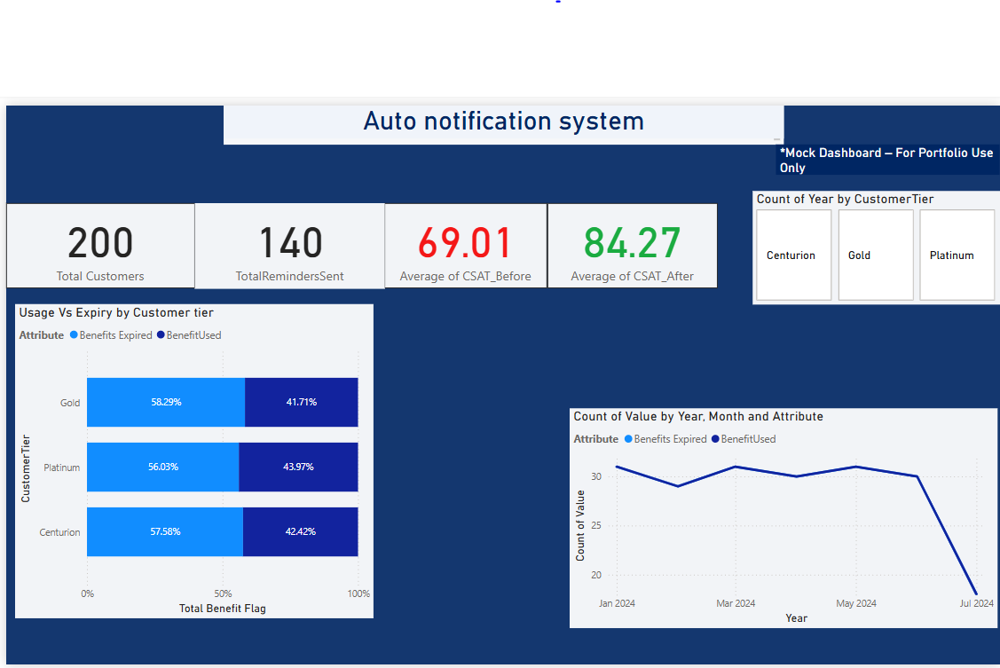

# Mock Power BI Business Analyst Case – Auto Notification System

This project simulates a business case aligned with internal BA responsibilities at American Express. It demonstrates dashboarding, DAX, and data storytelling, using a customer-centric use case for benefit expiry notifications.

---

---

## 📊 Dashboard Summary

- 📌 **Use Case**: Improve benefit utilization by sending automated expiry reminders
- 📈 **Objective**: Increase CSAT while ensuring compliance with retention restrictions
- 🎯 **Impact**: CSAT rose from 69.01 to 84.27 after notifications

---

## 🧮 DAX Measures Used

- `Total Customers = DISTINCTCOUNT(Table1[CustomerID])`
- `TotalRemindersSent = CALCULATE(COUNTROWS(Table1), Table1[ReminderSent] = "Yes")`
- `CSAT_Before Avg = AVERAGE(Table1[CSAT_Before])`
- `CSAT_After Avg = AVERAGE(Table1[CSAT_After])`
- `Benefit Used % = DIVIDE([BenefitUsed], [BenefitUsed] + [BenefitsExpired], 0)`

---

## 📈 Visualizations Used

- KPI Cards: CSAT before/after, customer/reminder count
- Stacked Bar: Benefit used vs expired by Customer Tier
- Line Chart: Monthly trend of expired vs used benefits
- Slicer: Customer Tier filter panel

---

## 🧱 Data Model

- Single table used: `Table1`
- Contains columns for: CustomerID, Tier, ReminderSent, BenefitUsed, CSAT scores, Dates
- All measures created in a dedicated Measure Table for clarity
- No external data connections or complex joins

---

## 📎 Related Documents

View supporting requirement documents (FRD, BRD) here:  
🔗 [Analyst Portfolio Repository](https://github.com/mayank-portfolio/analyst-portfolio)

---

## 🧠 Skills Demonstrated

- Power BI dashboard development
- DAX calculations and aggregations
- Functional thinking with stakeholder perspective
- GitHub versioning and documentation
